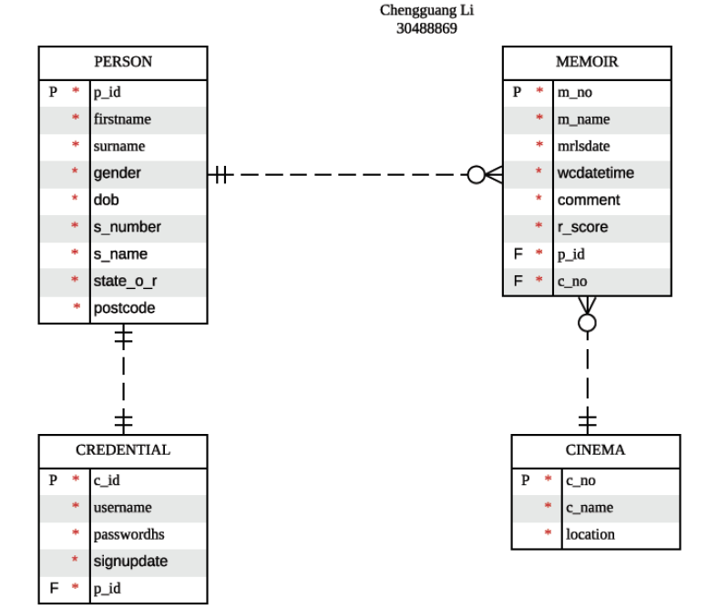

# Movie Memoir-backend

### ERD Diagram
<p align="center">
  
</p>


## Create Tables

### Create Person Table SQL Code 

```sql
CREATE TABLE person(
p_id NUMERIC(8) NOT NULL,
firstname VARCHAR(20) NOT NULL,
surname VARCHAR(20) NOT NULL,
gender VARCHAR(6) NOT NULL,
dob DATE NOT NULL,
s_number NUMERIC(8) NOT NULL,
s_name VARCHAR(20) NOT NULL,
state_o_r VARCHAR(20) NOT NULL,
postcode NUMERIC(6) NOT NULL
);
ALTER TABLE person ADD CONSTRAINT person_pk PRIMARY KEY (p_id);
#Comments about Person Table Code
COMMENT ON COLUMN person.p_id IS 'person id';
COMMENT ON COLUMN person.firstname IS 'first name';
COMMENT ON COLUMN person.surname IS 'surname';
COMMENT ON COLUMN person.gender IS 'gender';
COMMENT ON COLUMN person.dob IS 'date of birth';
COMMENT ON COLUMN person.s_number IS 'street number';
COMMENT ON COLUMN person.s_name IS 'street name';
COMMENT ON COLUMN person.state_o_r IS 'state of residence';
COMMENT ON COLUMN person.postcode IS 'postcode';
```

### Create Credentials Table SQL Code

```sql
CREATE TABLE credential(
c_id NUMERIC(8) NOT NULL,
username VARCHAR(40) NOT NULL,
passwordhs VARCHAR(32) NOT NULL,
signupdate DATE NOT NULL,
p_id NUMERIC(8) NOT NULL
);
ALTER TABLE credential ADD CONSTRAINT credential_pk PRIMARY KEY (c_id);
#Comments about Credentials Table Code
COMMENT ON COLUMN credential.c_id IS 'credential id';
COMMENT ON COLUMN credential.username IS 'username(email)';
COMMENT ON COLUMN credential.passwordhs IS 'password hash,length of MD5 is 32';
COMMENT ON COLUMN credential.signupdate IS 'sign up date ';
```

### Create Memoir Table SQL Code

```sql
CREATE TABLE memoir(
m_no NUMERIC(8) NOT NULL,
m_name VARCHAR(20) NOT NULL,
mrlsdate DATE NOT NULL,
wcdatetime DATE NOT NULL,
comment VARCHAR(20) NOT NULL,
r_score NUMERIC(2,1) NOT NULL,
p_id NUMERIC(8) NOT NULL,
c_no NUMERIC(8) NOT NULL
);
ALTER TABLE memoir ADD CONSTRAINT memoir_pk PRIMARY KEY (m_no);
#Comments about Memoir Table Code
COMMENT ON COLUMN memoir.m_no IS 'memoir id';
COMMENT ON COLUMN memoir.m_name IS 'movie name';
COMMENT ON COLUMN memoir.mrlsdate IS 'movie release date';
COMMENT ON COLUMN memoir.wcdatetime IS 'date and time that the user watched the movie';
COMMENT ON COLUMN memoir.comment IS 'comment about user opinion';
COMMENT ON COLUMN memoir.r_score IS 'rating score';
```

### Create Cinema Table SQL Code:

```SQL
CREATE TABLE cinema(
c_no NUMERIC(8) NOT NULL,
c_name VARCHAR(20) NOT NULL,
location NUMERIC(10) NOT NULL
);
ALTER TABLE cinema ADD CONSTRAINT cinema_pk PRIMARY KEY (c_no);
#Comments about Cinema Table Code
COMMENT ON COLUMN cinema.c_no IS 'cinema id';
COMMENT ON COLUMN cinema.c_name IS 'cinema name';
COMMENT ON COLUMN cinema.location IS 'cinema location(postcode)';
```


## Add Foreign Key SQL Code

```sql
ALTER TABLE memoir ADD CONSTRAINT person_memoir FOREIGN KEY (p_id) REFERENCES person (p_id) ON DELETE CASCADE;

ALTER TABLE memoir ADD CONSTRAINT cinema_memoir FOREIGN KEY (c_no) REFERENCES cinema (c_no) ON DELETE CASCADE;

ALTER TABLE credential ADD CONSTRAINT person_credential FOREIGN KEY (p_id) REFERENCES person (p_id) ON DELETE CASCADE;
```

## Add Primary Key SQL Code For Each Table

```sql
#Person 
ALTER TABLE person ADD CONSTRAINT person_pk PRIMARY KEY (p_id);
#Credentials
ALTER TABLE credential ADD CONSTRAINT credential_pk PRIMARY KEY (c_id);
#Memoir
ALTER TABLE memoir ADD CONSTRAINT memoir_pk PRIMARY KEY (m_no);
#Cinema
ALTER TABLE cinema ADD CONSTRAINT cinema_pk PRIMARY KEY (c_no);
```


